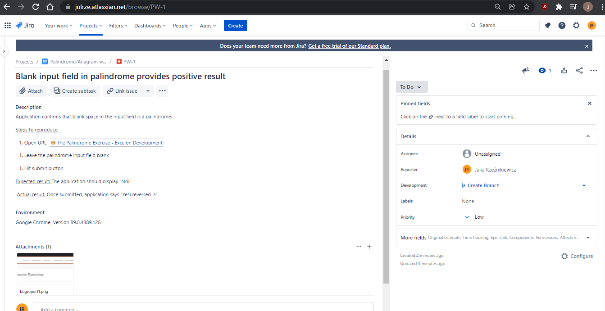
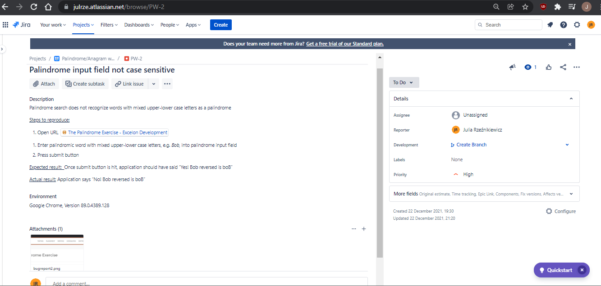

# About me
My name's Julia Rzeźnikiewicz. I'd like this place to be dedicated to collecting my personal studies on the subject of software testing. 

## Books and sources 
- Radosław Smilgin *"Zawód tester. Od decyzji do zdobycia doświadczenia"*
- ISTQB CTFL Syllabus 

## Courses and webinars
- *Software testing for absolute beginner*. Udemy course, After school
- *Wstęp do testowania oprogramowania*. Udemy course, Mateusz Kruszyk
- *Agile testing course for absolute beginner*. Udemy course, After school
- *Testowanie API – wstęp dla laików*. Webinar, Tomasz Stelmach
- *Introduction to database and SQL querying*. Udemy course, Rakesh Gopalakrishnan

## Sample test cases for *The palindrome exercise*
The above-mentioned [The palindrome exercise](https://xndev.com/palindrome) offers a free opportunity for bug reporting practice. While doing the task, I found Jira tool to be useful.
### Bug report 1

### Bug report 2

### Bug report 3

